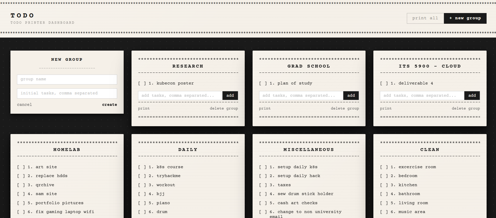

# Todo Printer Web

A web dashboard for managing thermal receipt printer to-do lists. Create groups, add tasks, and print directly to an ESC/POS network printer from your browser.

---

## Preview



---

## Features

- View all task groups as receipt-styled cards
- Add tasks to existing groups
- Create new groups with optional initial tasks
- Remove individual tasks or entire groups
- Print a single group or all groups at once
- Thermal receipt aesthetic to match what prints

---

## Background

This started as a companion to the [Discord bot](https://github.com/eb613819/todo-printer-bot). I wanted a way to manage tasks from a browser without needing to open Discord. Building it was also my first time using FastAPI, and the auto-generated `/docs` Swagger UI made it easy to visualize and test each endpoint as I built them.

One deliberate design decision: data-protecting logic (checking if a group exists before adding to it, bounds-checking task indices) lives in the API rather than the frontend, since the API is the only thing with direct access to `tasks.json` and is the single source of truth.

The UI is designed to look like the receipts it produces by using a monospace font, `*` and `=` borders, and numbered checkboxes.

---

## How It Works

The project has two parts that run together on the same machine:

**`api.py`** — A FastAPI backend that runs as a system service. It reads and writes `tasks.json`, handles all printer communication, and serves the compiled Angular app as static files in production. Every action in the UI goes through a REST endpoint here.

**`ui/`** — An Angular app that runs in the browser. It talks to `api.py` over HTTP to load and update tasks. It has no direct access to the filesystem: `api.py` is the middleman.

```
Browser → api.py (port 8000) → tasks.json
                             → ESC/POS printer
```

In production, one process (`api.py`) handles everything. In development, `api.py` and `ng serve` run separately with Angular's dev proxy forwarding `/api` requests to the backend.

---

## Repo Structure

```
todo-printer-web/
├── api.py                  # FastAPI backend — REST API + static file server
├── requirements.txt        # Python dependencies
├── tasks.json              # Created at runtime, gitignored. Location can be changed with Environment variable
└── ui/                     # Angular project
    ├── angular.json
    ├── package.json
    ├── proxy.conf.json     # Dev only (forwards /api to localhost:8000)
    └── src/
        └── app/
            ├── app.component.*         # Root layout, grid, print controls
            ├── tasks.service.ts        # HTTP calls to api.py
            └── group-card/             # Individual task group card component
```

---

## My Setup

| Component | Details |
|-----------|---------|
| VM | Debian 12 LXC container on Proxmox |
| Printer | Rongta RP326 80mm Thermal Receipt Printer |
| Printer Connection | Ethernet (ESC/POS over network) |
| Python | 3.11.2 |
| Node | 24.x (via nvm) |

---

## Setup

### 1. Clone the Repo

```bash
git clone https://github.com/eb613819/todo-printer-web.git
cd todo-printer-web
```

### 2. Install Python Dependencies

```bash
pip3 install -r requirements.txt --break-system-packages
```

> **Note:** The `--break-system-packages` flag is required on Debian/Ubuntu systems that restrict pip from installing globally.

### 3. Install Node and Angular CLI

If Node is not installed, use nvm:

```bash
curl -o- https://raw.githubusercontent.com/nvm-sh/nvm/v0.39.7/install.sh | bash
source ~/.bashrc
nvm install --lts
```

Then install the Angular CLI and project dependencies:

```bash
npm install -g @angular/cli
cd ui
npm install
```

### 4. Configure api.py

Open `api.py` and update the config variables at the top if needed:

```python
DATA_FILE = Path(os.environ.get("TASKS_FILE", "tasks.json"))
PRINTER_IP = os.environ.get("PRINTER_IP", "YOUR_PRINTER_IP")
PRINTER_PORT = int(os.environ.get("PRINTER_PORT", "9100"))
```

These can also be set via environment variables in your systemd service file instead of editing the source directly.

### 5. Build the Angular App

```bash
cd ui
ng build
```

This compiles the Angular app into `ui/dist/ui/browser/`. The `api.py` backend will serve these files automatically.

> **Note:** `ng build` requires around 1GB of available memory. If you are on a memory-constrained machine, add swap first or build locally and copy the `dist/` folder over via `scp`.

### 6. Run on Startup with systemd

Create the service file:

```bash
nano /etc/systemd/system/todo_web.service
```

Paste the following, updating paths and environment variables as needed:

```ini
[Unit]
Description=Todo Printer Web API
After=network.target

[Service]
Type=simple
User=root
WorkingDirectory=/root/todo-printer-web
ExecStart=/usr/bin/python3 /root/todo-printer-web/api.py
Environment="PRINTER_IP=YOUR_PRINTER_IP"
Environment="TASKS_FILE=/root/tasks.json"
Restart=on-failure
RestartSec=5

[Install]
WantedBy=multi-user.target
```

Enable and start the service:

```bash
systemctl daemon-reload
systemctl enable todo_web
systemctl start todo_web
systemctl status todo_web
```

### 7. Access the Dashboard

Open a browser and go to:

```
http://YOUR_MACHINE_IP:8000
```

The API docs are also available at:

```
http://YOUR_MACHINE_IP:8000/docs
```

---

## Printer Setup

The printer connects via Ethernet. Make sure it:

- Is on the **same local network** as the machine running the API
- Has a static or reserved IP address
- Has ESC/POS enabled (default on most thermal receipt printers)

To find your printer's IP, open its web interface or check your router's connected devices list.

---

## Development

To run the project locally for development, you need two terminals:

**Terminal 1 — start the API:**

```bash
python3 api.py
```

**Terminal 2 — start the Angular dev server:**

```bash
cd ui
ng serve
```

Then open `http://localhost:4200`. The Angular dev server proxies all `/api/*` requests to `api.py` on port 8000 via `proxy.conf.json`, so both work together.

The API docs are available at `http://localhost:8000/docs` and are useful for testing endpoints directly as you develop.

### Updating After Changes

After making changes to the Angular app, rebuild and restart:

```bash
cd ui && ng build
sudo systemctl restart todo_web
```

---

## Connecting to the Discord Bot

This project is designed to work alongside [todo-printer-bot](https://github.com/eb613819/todo-printer-bot), a Discord bot that manages the same task lists and prints to the same thermal printer. The two projects are completely independent; you can use either or both.

To share tasks between them, point both at the same `tasks.json` file using the `TASKS_FILE` environment variable.

In this project's systemd service:
```ini
Environment="TASKS_FILE=/root/tasks.json"
```

In the Discord bot's systemd service:
```ini
Environment="TASKS_FILE=/root/tasks.json"
```

Both projects read and write the same file format. Any task added from Discord is immediately visible in the web UI and vice versa.

---

## Dependencies

| Package | Purpose |
|---------|---------|
| fastapi | REST API framework |
| uvicorn | ASGI server |
| python-escpos | ESC/POS printer communication |
| @angular/core | Frontend framework |

---
